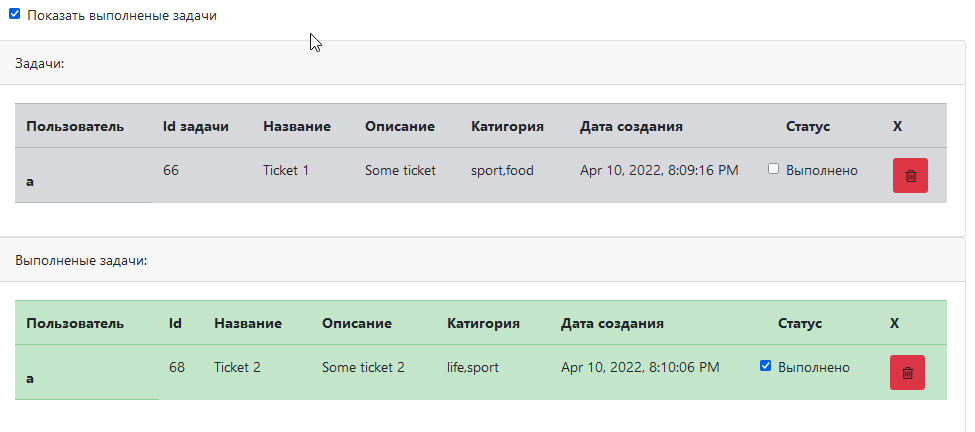

Проект "Список дел".
Проект создавался для отработки знаний связанных с JSP, Java Servlets, Hibernate.

Приложение имеет одну страницу со списком дел index.html.

Если дело сделано, то его отмечают, как выполненное и оно исчезает из списка.

1. Oдна таблица в базе ticket с полями id, description, created, done. Расположение /db/
2. Веб приложение должно иметь одну страницу index.html.
3. Все данные на форму загружаться через ajax.
4. Вверху форма. Добавить новое задание. описание.
5. Список всех заданий и галка выполнено или нет.
6. Вверху добавить галку. Показать все. Если включена, то показывать все. Если нет, то только те, что не выполнены done = false.
7. Данные сохраняются через hibernate.
8. Для вида использовать bootstrap.
9. Каждая задача может быть отнесена к какой-либо категории.

Проект требует доработки на frontend.
Пока что запускается через tomcat7:run

